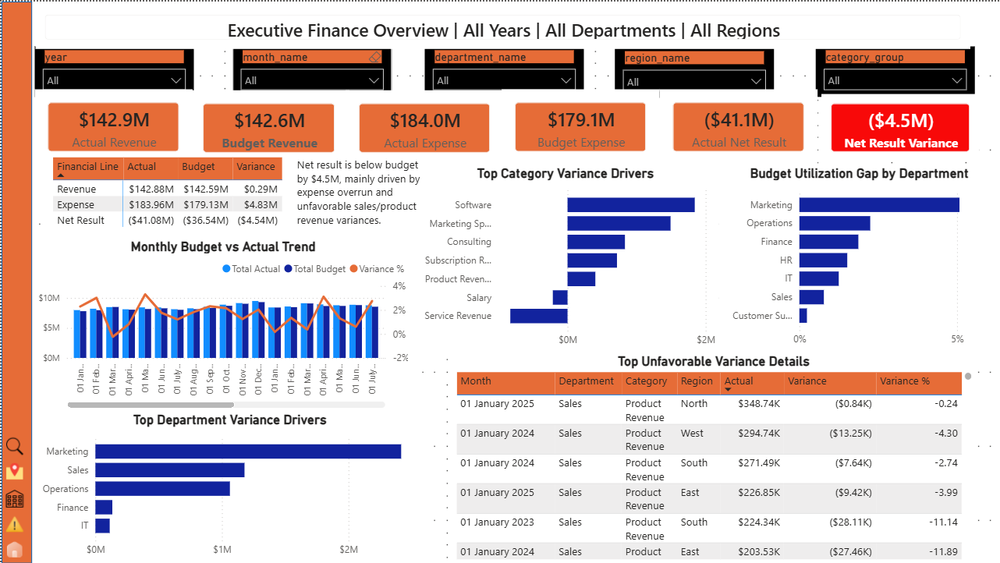
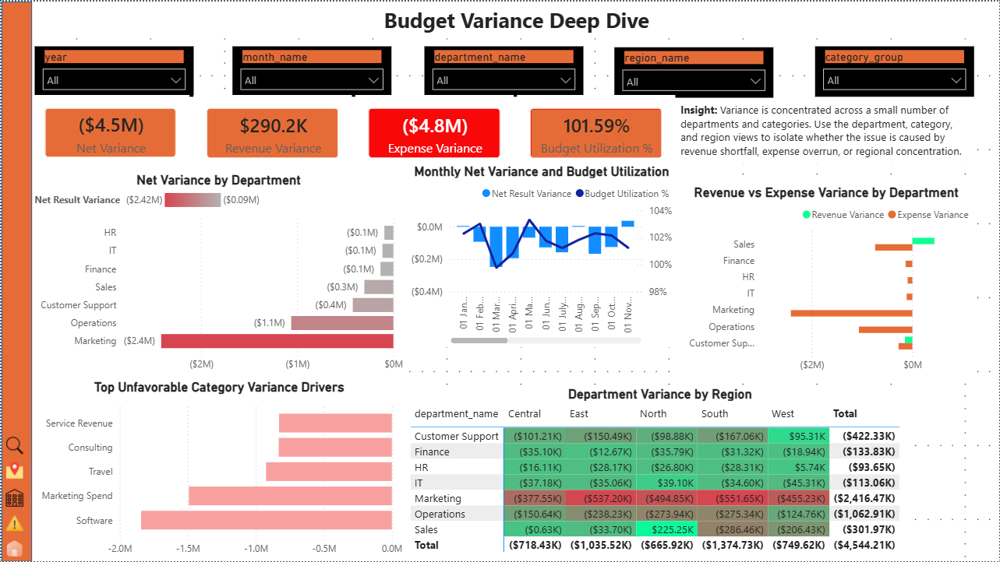
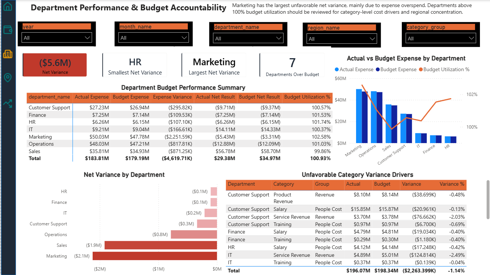
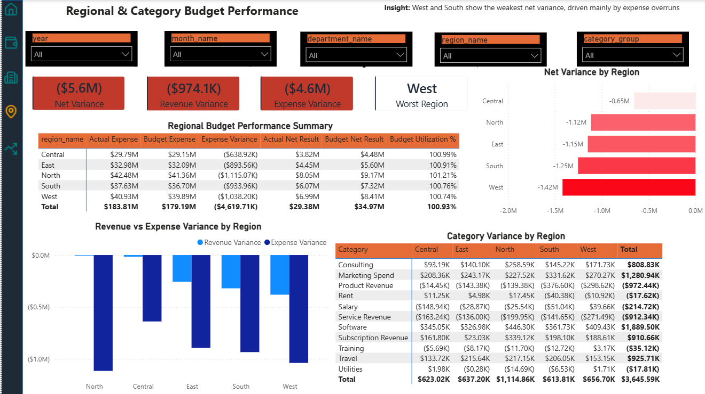
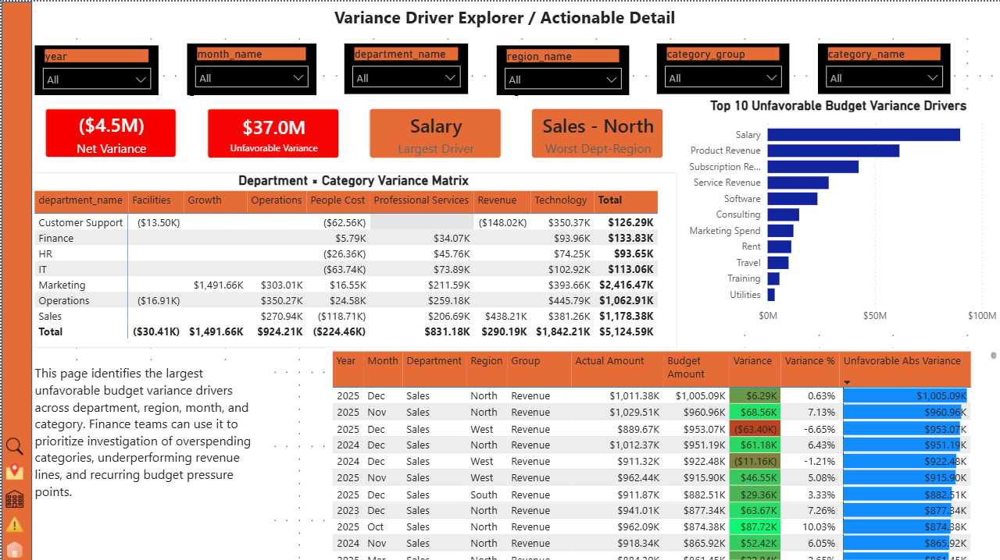

# Finance Budget vs Actual Dashboard

[](powerbi/BudgetvsActual.pdf)

> **[📄 View the full multi-page report (PDF)](powerbi/BudgetvsActual.pdf)** &nbsp;|&nbsp; Open `powerbi/BudgetvsActual.pbix` in Power BI Desktop to interact with all five pages.

| Variance Deep Dive | Department Accountability | Regional & Category | Variance Explorer |
|:---:|:---:|:---:|:---:|
| [](screenshots/02_budget_variance_deep_dive.png) | [](screenshots/03_department_performance.png) | [](screenshots/04_regional_category_performance.png) | [](screenshots/05_variance_explorer.png) |

> ℹ️ *The dataset is fully synthetic, generated in Python to mirror realistic FP&A patterns (seasonality, salary inflation, departmental cost structures, and controlled budget variance). It contains no real or proprietary financial data.*

## Project Overview

This project is an end-to-end Finance Budget vs Actual Dashboard built using Python, SQL Server, Power BI, and DAX.

The dashboard analyzes financial performance by comparing actual revenue and expenses against budgeted values across months, departments, regions, and financial categories. The goal is to help finance teams identify budget overruns, revenue shortfalls, unfavorable variance drivers, and accountability areas across the organization.

At the company level, the business runs a positive net result of **$29.4M actual** against a **$34.97M budget**, leaving a **net result variance of ($5.6M)**. The shortfall is driven mainly by a **$4.6M expense overrun**, with revenue finishing slightly under plan (($1.0M) revenue variance).

The project simulates a realistic finance analytics workflow:

1. Synthetic finance dataset generation using Python
2. Data storage and validation in SQL Server
3. Creation of reporting views for Power BI
4. Data modeling and DAX measures in Power BI
5. Multi-page executive dashboard design
6. Variance analysis and drill-down reporting

---

## Business Problem

Finance leaders need to monitor whether departments, regions, and categories are performing in line with budget expectations.

Typical questions answered by this dashboard include:

- Is the company over or under budget overall?
- Which departments are driving unfavorable variance?
- Are revenue shortfalls or expense overruns causing the biggest issue?
- Which regions have the weakest budget performance?
- Which financial categories require management attention?
- How does variance change over time?
- Where should leadership focus corrective action?

---

## Tools Used

- **Python**: Synthetic data generation
- **SQL Server**: Data storage, staging tables, validation, reporting views
- **Power BI**: Dashboard development and data visualization
- **DAX**: Financial KPIs, variance measures, utilization metrics, ranking logic
- **Power Query**: Data type handling and model preparation

---

## Dataset

The dataset was synthetically generated to resemble a realistic corporate finance environment. Revenue is spread across the revenue-generating departments (Sales, Customer Support, and others), while Finance and HR operate as pure cost centers. This produces a realistic profitable company with a modest budget shortfall rather than an artificial net loss.

### Main tables

- `dim_date`
- `dim_department`
- `dim_category`
- `dim_region`
- `fact_budget`
- `fact_actuals`

### Dataset characteristics

- Multiple years (2023–2025) of monthly financial data
- Revenue and expense categories
- Department-level and region-level budgeting
- Actual transaction-level financial records
- Budget data stored at monthly planning grain
- Actuals stored at detailed transaction grain
- A separate "dirty" version of the fact tables with seeded data-quality issues (duplicates, zero/negative amounts, missing keys, orphan actuals) for SQL validation exercises

This structure allows realistic budget vs actual analysis using different levels of aggregation.

---

## SQL Server Workflow

The data was imported into SQL Server using a staging schema and then transformed into reporting-ready views.

### Schemas

- `staging`: Raw imported tables
- `finance`: Reporting views used in Power BI

### Validation checks included

- Row count validation
- Duplicate budget grain check
- Date table validation
- Actuals and budget reconciliation
- Dimension relationship checks

### Reporting views

The SQL views were designed to simplify Power BI modeling and support dashboard visuals such as:

- Monthly budget vs actual trends
- Department variance summaries
- Regional variance summaries
- Category-level variance analysis
- Unfavorable variance drill-down tables
- Budget utilization and YTD budget vs actual

---

## Dashboard Pages

The report has five pages with a shared dark-slate side navigation panel using compact icon buttons for moving between views.

## Page 1: Executive Finance Overview

This page provides a high-level summary of company-wide financial performance.

### Key visuals

- Actual Revenue ($213.2M) / Budget Revenue ($214.2M)
- Actual Expense ($183.8M) / Budget Expense ($179.2M)
- Actual Net Result ($29.4M)
- Net Result Variance (($5.6M))
- Financial line matrix (Revenue → Expense → Net Result)
- Monthly Budget vs Actual Trend
- Top Category Variance Drivers
- Budget Utilization Gap by Department
- Top Department Variance Drivers
- Top Unfavorable Variance Details
- Executive insight text box


---

## Page 2: Budget Variance Deep Dive

This page focuses on detailed variance analysis across departments and time.

### Key visuals

- Net Variance (($5.6M))
- Revenue Variance (($974.1K))
- Expense Variance (($4.6M))
- Budget Utilization % (100.93%)
- Net Variance by Department
- Monthly Net Variance and Budget Utilization
- Revenue vs Expense Variance by Department
- Top Unfavorable Category Variance Drivers
- Department Variance by Region matrix
- Executive insight text box


---

## Page 3: Department Performance & Budget Accountability

This page identifies which departments are performing well or poorly against budget.

### Key visuals

- Net Variance (($5.6M))
- Smallest Net Variance (HR)
- Largest Net Variance (Marketing)
- Departments Over Budget (7)
- Department Budget Performance Summary matrix
- Actual vs Budget Expense by Department
- Net Variance by Department
- Unfavorable Category Variance Drivers

> Note: the smallest / largest net variance cards replace the earlier "Best Department" / "Worst Department" labels, since cost centers such as HR cannot be evaluated on the same basis as revenue-generating departments.


---

## Page 4: Regional & Category Budget Performance

This page analyzes regional financial performance and category-level variance.

### Key visuals

- Net Variance (($5.6M))
- Revenue Variance (($974.1K))
- Expense Variance (($4.6M))
- Worst Region (West)
- Regional Budget Performance Summary matrix
- Net Variance by Region
- Revenue vs Expense Variance by Region
- Category Variance by Region matrix
- Executive insight text box


---

## Page 5: Variance Driver Explorer / Actionable Detail

This page acts as an interactive drill-down page for investigating detailed variance drivers across department, region, month, and category.

### Key visuals

- Net Variance (($5.6M))
- Unfavorable Variance (($1.5M))
- Largest Driver (Product Revenue)
- Worst Dept-Region (Sales - West)
- Gross Unfavorable Variance by Category
- Department × Category Variance matrix
- Detailed variance table with data bars
- Department, region, category, and month slicers


---

## Key Insights

- The company is profitable ($29.4M net) but $5.6M below budget, driven primarily by a $4.6M expense overrun rather than a revenue collapse.
- Marketing has the largest unfavorable net variance, mainly from expense overspend; HR has the smallest.
- All seven departments are running above 100% budget utilization on expenses.
- Among regions, West shows the weakest net variance, with South close behind, both driven by expense overruns.
- Software, Marketing Spend, and Travel are recurring expense overrun categories; Product and Service Revenue are the main revenue shortfalls.

---

## Challenges and Fixes

- **Power BI date parsing**: month values were mis-parsed on model load. A Power Query workaround using `Date.Day([month_start_date])` as the month component produced correct month ordering and is intentionally retained.
- **Data rebalance**: an earlier dataset concentrated revenue in too few departments, producing an unrealistic company-wide net loss. Spreading revenue across multiple departments and keeping Finance/HR as cost centers produced a realistic profitable result with a modest budget shortfall.

---

## How to Use

Review the SQL scripts (`sql/`), the dataset generator (`scripts/`), the Power BI file (`powerbi/`), and the page screenshots (`screenshots/`). Open the `.pbix` in Power BI Desktop to interact with slicers, drill-downs, and cross-filtering across all five pages.

---

## Repository Structure

```text
Finance-Budget-vs-Actual-Dashboard/
├── README.md
├── data/
│   └── raw/                       # Generated CSVs (clean + dirty fact tables, dimensions)
├── scripts/
│   └── generate_finance_dataset.py   # Python synthetic data generator
├── sql/
│   ├── 01_create_database_and_schemas.sql
│   ├── 02_validation_queries.sql
│   └── 03_reporting_views.sql        # finance.* views consumed by Power BI
├── powerbi/
│   ├── BudgetvsActual.pbix           # Power BI report
│   └── BudgetvsActual.pdf            # Full multi-page report export
├── screenshots/
│   ├── 01_executive_finance_overview.png
│   ├── 02_budget_variance_deep_dive.png
│   ├── 03_department_performance.png
│   ├── 04_regional_category_performance.png
│   └── 05_variance_explorer.png
└── icons/                         # Navigation icons used in the report
```
